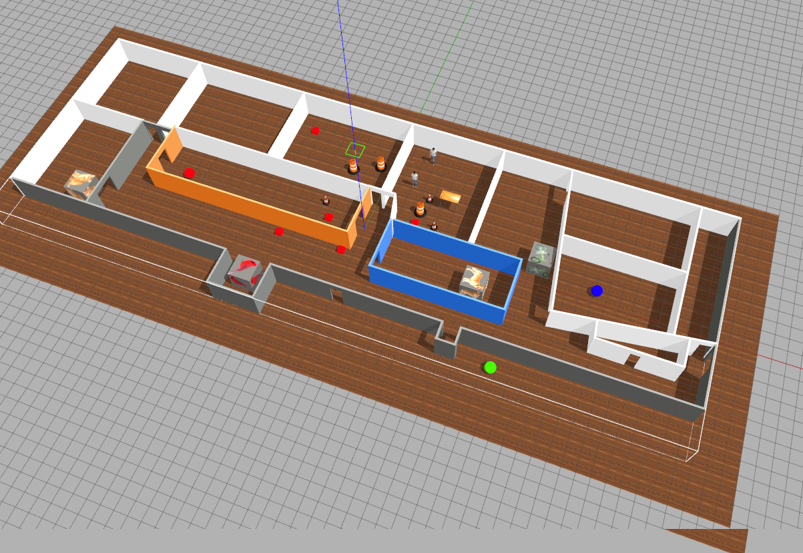
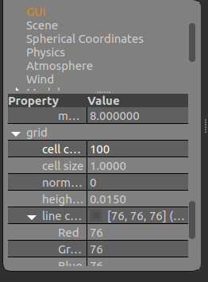

# Projeto Delta



## Adequação e critérios

Este projeto deverá ser realizado por todos os grupos que não atingiram pelo menos conceito `C` no Projeto de Robótica.

Completar este projeto leva grupos *que já entregaram* o projeto 1 ao conceito C.

## Objetivo do robô

O robô receberá uma lista de objetos a localizar no 4.o andar e tem que *tirar uma foto* ou seja, capturar subimagem de cada objeto desejado.

Pode ser necessário localizar mais de um objeto numa rodada do código.  Pode

Exemplo:

```python
goal = ["cat", "green_sphere"]
```

A partir do objetivo abaixo o robô precisa achar um jeito de percorrer o 4.o andar e localizar a esfera verde e o gato.  Deve adotar alguma estratégia de percorrer o andar.

Assim que localizar um objeto precisa capturar o retângulo que contém o objeto fazendo slicing e depois prosseguir em direção ao próximo

Quando terminar deve escrever uma mensagem clara na tela para avisar que terminou, e parar.


## O que é para fazer

Defina uma rota de pontos-chave no mapa usando odometria e, ao longo dessa rota, o robô deve procurar os objetos.  Periodicamente o robô deve parar e gazer um giro de 360 graus para procurar os objetos.


## Formato do objetivo

Elementos possíveis

```python

"person"

"cat"

"dog"

"bird"

"blue_sphere"

"red_sphere"

"green_sphere"

"bike"
```

Para lançar o mapa atualize o repositório [my_simulation](https://github.com/arnaldojr/my_simulation/) e faça:

    roslaunch my_simulation esconde-esconde.launch

Para ver o grid do chão com mais células para ter uma referência melhor use a opção `GUI` `grid` `cell count`



Lembre-se que as coordenadas de odometria são centradas na posição inicial do robô, e não no `(0,0,0)` do universo.


# Dica

Sugerimos que estude a solução da questão de odometria da Prova P2 

https://github.com/mirwox/p2/blob/solution/p2_20/scripts/Q3_controle.py

Também sugerimos o estudo da questão de deteção de esferas da P2

https://github.com/mirwox/p2/blob/solution/p2_20/scripts/Q4_formas.py


